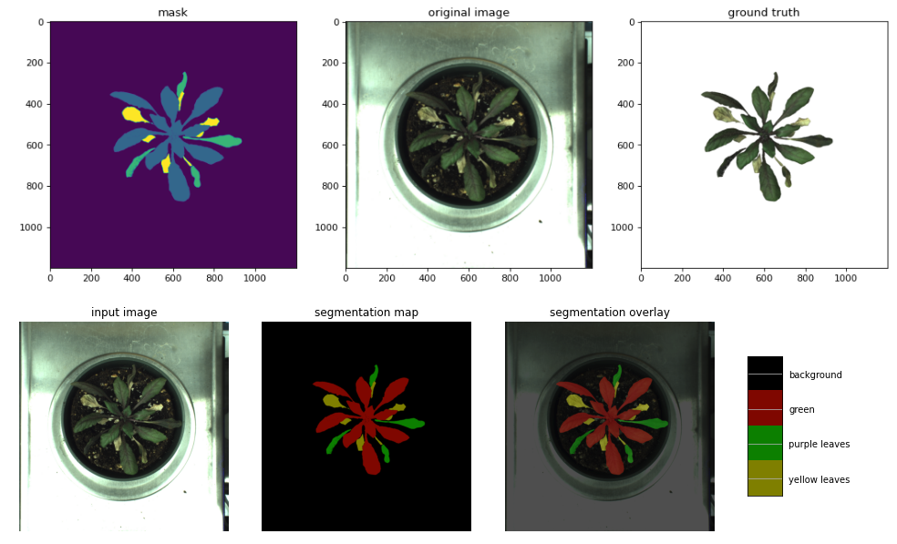
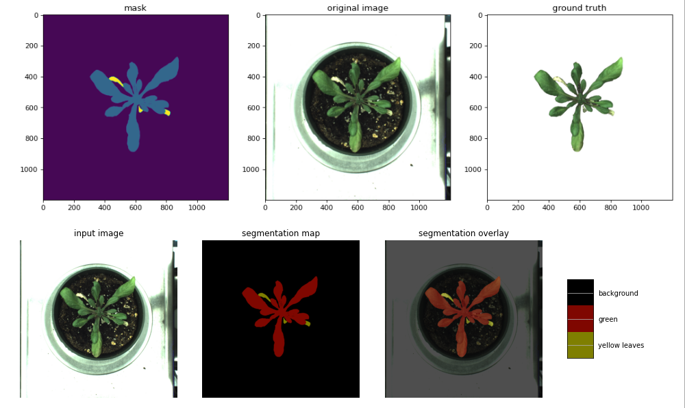
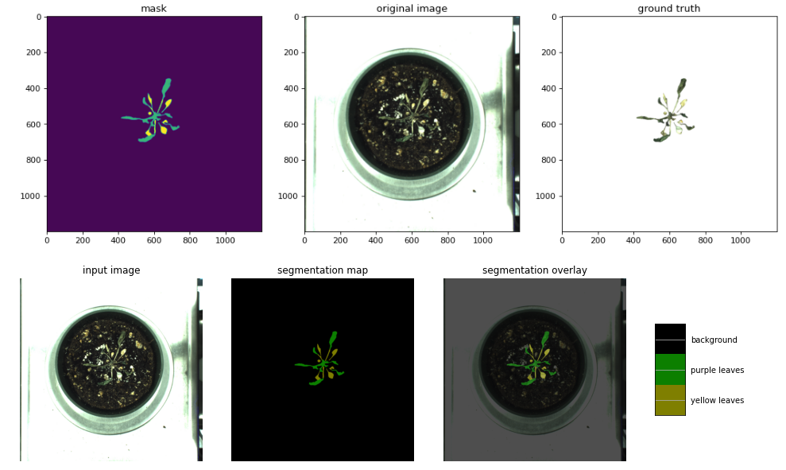
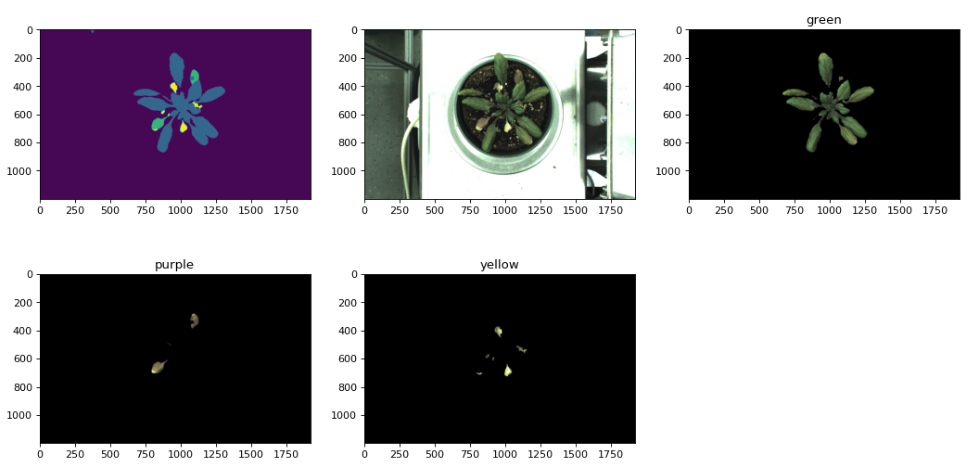
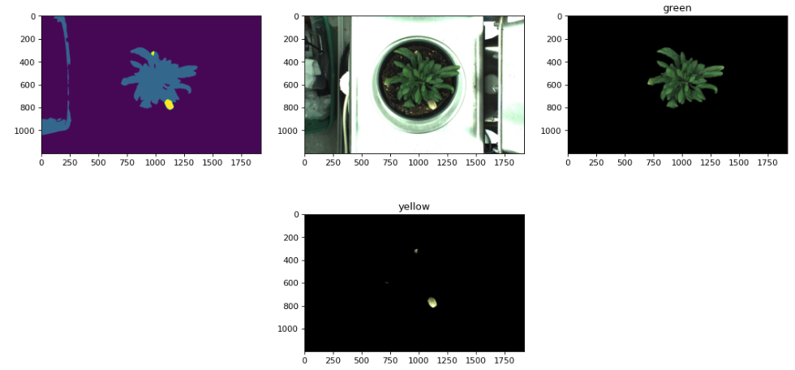
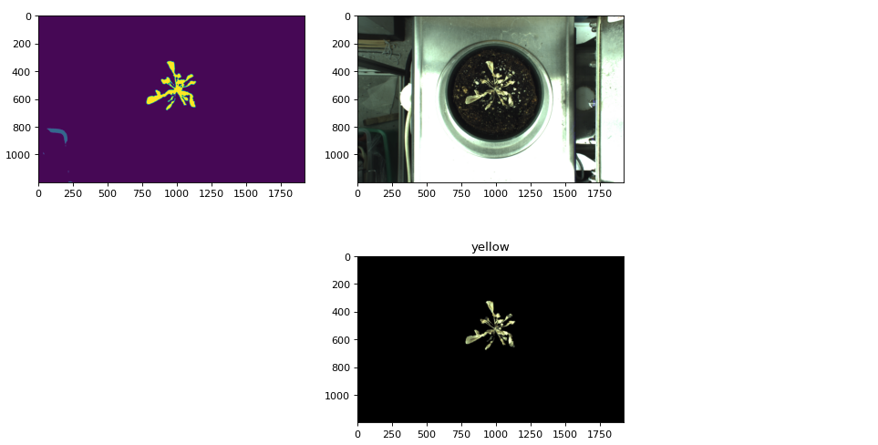

# pytorch-deeplab-xception

### TODO
- [x] More data training


### Introduction
This is a PyTorch(0.4.1) implementation of [DeepLab-V3-Plus](https://arxiv.org/pdf/1802.02611). We trained the model to segment Arabidopsis leaves into three categories, including green (healthy), purple (wilted), and yellow(dry) leaves. 

###	Label examples
- [x] Example 1

- [x] Example 2

- [x] Example 3


###	Prediction examples




### Installation
The code was tested with Anaconda and Python 3.6. After installing the Anaconda environment:

0. Clone the repo:
    ```Shell
    git clone https://github.com/lr-xiang/RoAD-image-processing-using-deeplab.git
    cd pytorch-deeplab-xception
    ```

1. Install dependencies:

    For PyTorch dependency, see [pytorch.org](https://pytorch.org/) for more details.

    For custom dependencies:
    ```Shell
    pip install matplotlib pillow tensorboardX tqdm
    ```
### Training
Follow steps below to train your model:

0. Configure your dataset path in [mypath.py](https://github.com/jfzhang95/pytorch-deeplab-xception/blob/master/mypath.py).

1. Input arguments: (see full input arguments via python train.py --help):
    ```Shell
    usage: train.py [-h] [--backbone {resnet,xception,drn,mobilenet}]
                [--out-stride OUT_STRIDE] [--dataset {pascal,coco,cityscapes}]
                [--use-sbd] [--workers N] [--base-size BASE_SIZE]
                [--crop-size CROP_SIZE] [--sync-bn SYNC_BN]
                [--freeze-bn FREEZE_BN] [--loss-type {ce,focal}] [--epochs N]
                [--start_epoch N] [--batch-size N] [--test-batch-size N]
                [--use-balanced-weights] [--lr LR]
                [--lr-scheduler {poly,step,cos}] [--momentum M]
                [--weight-decay M] [--nesterov] [--no-cuda]
                [--gpu-ids GPU_IDS] [--seed S] [--resume RESUME]
                [--checkname CHECKNAME] [--ft] [--eval-interval EVAL_INTERVAL]
                [--no-val]

    ```

2. To train deeplabv3+ using arab3 dataset and DRN as backbone:
    ```Shell
    python train.py --backbone drn --dataset arab3 --lr 0.007 --workers 1 --epochs 200 --batch-size 6 --gpu-ids 0 --checkname deeplab-drn 
    ```
3. To train deeplabv3+ using arab3 and ResNet as backbone:
    ```Shell
    python train.py --backbone resnet --dataset arab3 --lr 0.007 --workers 1 --epochs 200 --batch-size 8 --gpu-ids 0 --checkname deeplab-resnet 
    ```    

### Acknowledgement
[pytorch-deeplab-xception](https://github.com/jfzhang95/pytorch-deeplab-xception)

[PyTorch-Encoding](https://github.com/zhanghang1989/PyTorch-Encoding)

[Synchronized-BatchNorm-PyTorch](https://github.com/vacancy/Synchronized-BatchNorm-PyTorch)

[drn](https://github.com/fyu/drn)
